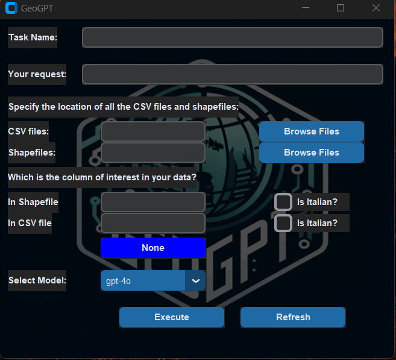

# GIS-LLM Project

## Setup Instructions

1. **Clone the Repository**  
   ```bash
   git clone https://github.com/NikhilMuralikrishna/GeoGPT_Project.git
   cd GeoGPT_Project

2. **Create a Virtual Environment**
   ```bash
   conda create -n Geo_GPT      # On Windows
   conda activate Geo_GPT
   
3. **Install Dependencies**
   Use pip to install the required dependencies:
   ```bash
   pip install -r requirements.txt


4. **Set Up Environment Variables**
   Create a .env file in the root directory and add your OpenAI API key in congif.ini:
   ```bash
   OPENAI_API_KEY=your_api_key_here     #Replace your_api_key_here with your actual API key

5. **Run the Application**
   Start the program with:
   ```bash
   python GeoGPT.py

## Interface Preview


